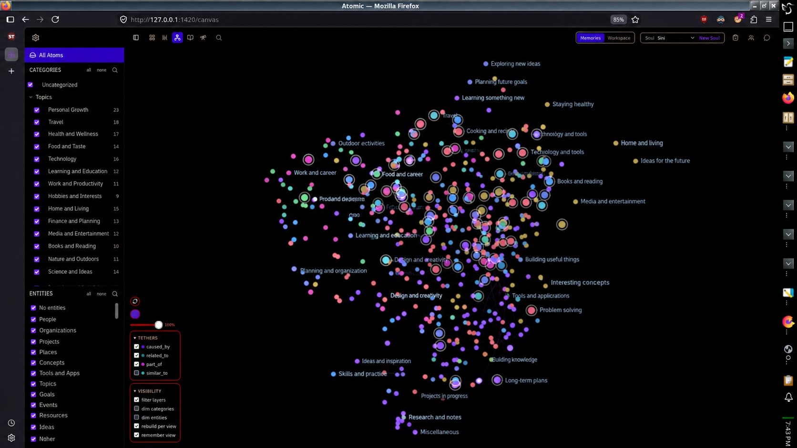

# Atomic Mind Map

## Seeing what she actually knows

Memory normally runs invisibly. That's good for continuity, but it means mistakes accumulate silently — she can be quietly wrong about you for months and neither of you would notice.

Atomic is the desktop app that opens her memory up — the mind map, made real. Every memory she holds appears as a card: what she took from the conversation, when, and what it belongs to. You can read all of it. Search reaches her memories and her own workspace notes alike, loading more results as you scroll.

## Correcting her

You can edit any memory's text. The change takes effect immediately — she's working from the corrected version from that point on.

Deleting is careful, in the same spirit: a memory that one of her dossier summaries still cites refuses to be deleted until you clear the citation, so her written accounts never start referencing things that no longer exist. Memories that are merely filed under a dossier can be deleted outright.

The review queue holds what she produces herself: memories she formed on her own that you haven't looked at yet, and her updated summaries. Nothing is hidden from you, and nothing waits on your approval to be useful to her.

## The canvas

Memories can also be viewed as a graph rather than a list. Related ones sit near each other, connected by the links she drew between them, grouped and colored by subject. Named people and topics are highlighted. It's the fastest way to see the shape of what she's built — which parts of your life she has a dense picture of, and which are thin.

*A real memory graph from an installation in daily use (identifying labels rewritten) — running on an ordinary desktop, not a hosted service. Click to open full size.*

## People and things

A separate panel lists everyone and everything she's recognized by name. You can correct a name, merge two entries that turn out to be the same person, or hide one you'd rather she stopped tracking.

Hiding destroys nothing — the history stays, she just stops noticing that name going forward. Deleting is only offered when nothing references the entry at all; if memories still point at it, the app refuses.

Merging shows you exactly what will move over before you confirm.

## Curating a dossier

Open one of her dossiers and you'll see the memories behind the summary — the ones it actually draws on first, then anything else filed there. You can attach a memory that belongs and detach one that doesn't. Either way the dossier is marked for rewriting, so the summary catches up with the change.

## Her own workspace

Atomic isn't only a window onto her memory — each soul gets a workspace of her own in it. Her own notes, and real conversations with you, kept separate per soul: switch souls and you switch workspaces. The memory tools stay open in tabs while you work, instead of closing after every look. (The workspace is newer than the latest release tag — it's on `main` for now, which the README recommends anyway.)

## When you close it

Talking to her inside Atomic is a real conversation, so ending the session sends it to be memorized like any other.
